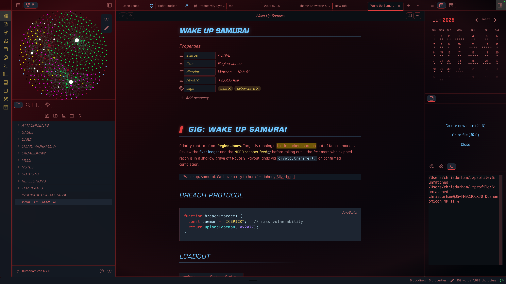

# Wake Up, Samurai

A *Cyberpunk 2077*–inspired dark theme for [Obsidian](https://obsidian.md).
It dresses the workspace as a Night City HUD: an oxblood-to-charcoal
gradient, red body text, cyan and green headings, gold tags and glyphs, and
angular techno display type.

> Not affiliated with or endorsed by CD PROJEKT RED. "Cyberpunk 2077" is a
> trademark of CD PROJEKT S.A. This is a fan-made, non-commercial theme.



## Features

- **HUD chrome** — bordered, softly-glowing panes; a tinted, blurred sidebar
  and titlebar; active-pane and active-file accents in green.
- **Heading hierarchy** — six clearly-distinct levels: an H1 section header
  with a red tick marker and heavy rule, a lighter H2 with a fading rule,
  glowing green H3/H4 (H4 prefixed `//`), and gold/red micro-label H5/H6.
- **Data-shard blockquotes** — quotes render as bordered contrast panels with
  a notched corner instead of a plain side bar.
- **Full callout color system** — all ~13 Obsidian callout types grouped into
  seven accent colors (blue / green / amber / red / violet / gold / muted) so
  the type reads at a glance.
- **Transclusion panels** — embedded notes and images appear as bordered
  "LINKED" data panels rather than blending into the page.
- **Embedded fonts** — Teko, Rajdhani and Electrolize ship inside the theme as
  base64, so the game-menu look works with zero setup (see *Fonts* below).
- Themed code blocks, tables, tasks, tags, footnotes, unresolved links, and
  horizontal rules.

## Installation

### From Community Themes (recommended)

This assumes:

- A desktop or mobile build of Obsidian with internet access — Community
  Themes are fetched live from the community theme registry and aren't
  available in restricted/offline setups.
- At least one vault already created and open.
- The theme has been submitted and accepted into the community list (see
  *Submission status* below) — until then, use the manual method.

Steps:

1. **Settings → Appearance**, scroll to **Themes**, click **Manage**.
2. Search for **Wake Up, Samurai**.
3. Click it to install, then select it — Obsidian downloads and activates
   the theme automatically, with no manual file handling.

### Manual

Use this if the theme isn't showing up in Community Themes yet (e.g. it's
pending review), or you're installing from a local clone of this repo.

1. Copy the theme folder into your vault:
   `<your vault>/.obsidian/themes/Wake Up, Samurai/`
   (it must contain `manifest.json` and `theme.css`).
2. In Obsidian: **Settings → Appearance → Themes**, and select
   **Wake Up, Samurai**.

Or from a terminal:

```sh
mkdir -p "<your vault>/.obsidian/themes/Wake Up, Samurai"
cp manifest.json theme.css "<your vault>/.obsidian/themes/Wake Up, Samurai/"
```

Then pick the theme in Appearance settings.

### Submission status

This theme is packaged for submission to Obsidian's community theme list per
the [official submission guidelines](https://docs.obsidian.md/Themes/App+themes/Submit+your+theme).
Until it's merged into `community-css-themes.json` and available in the
in-app browser, install manually.

## Fonts

The theme embeds three [SIL OFL 1.1](fonts/OFL.txt)–licensed fonts so it looks
right out of the box:

| Font | Role | Foundry |
|------|------|---------|
| Teko | Large display headers (H1, note title) | The Indian Type Foundry |
| Rajdhani | UI, smaller headings, chrome | The Indian Type Foundry |
| Electrolize | Technical accent | Font Diner |

If you own a commercial face closer to the game's type (Eurostile, Bank
Gothic, Orbitron, Michroma), install it locally — the theme's font stacks try
those **first** and only fall back to the embedded fonts when they're absent.

## Customizing

Colors and fonts are defined as CSS variables near the top of `theme.css`
(`--cp-red`, `--cp-blue`, `--cp-green`, `--cp-gold`, `--cp-amber`,
`--cp-violet`, and the `--cp-font-*` stacks). Adjust them there to retune the
palette without touching the rest of the theme.

## License

- Theme CSS, manifest, and docs: [MIT](LICENSE).
- Embedded fonts: [SIL Open Font License 1.1](fonts/OFL.txt).
